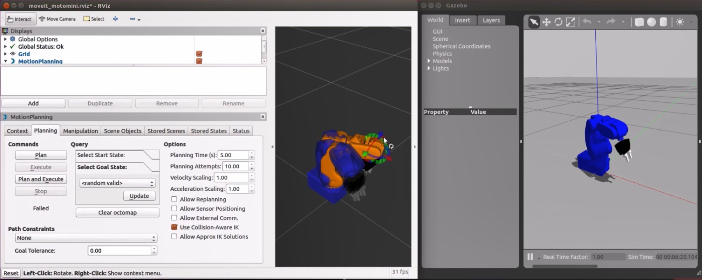
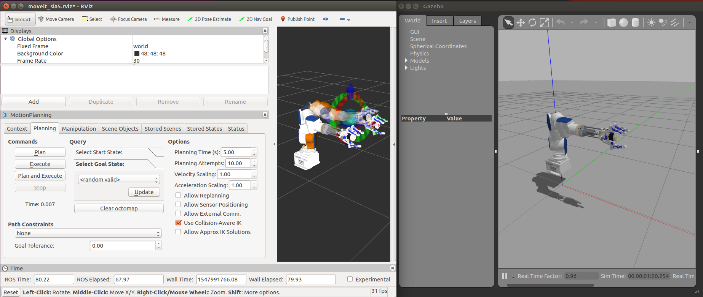
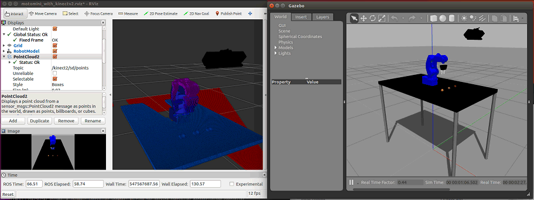
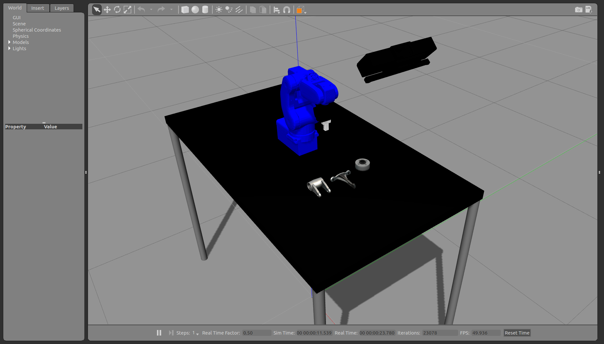

# motoman_apps [](https://travis-ci.org/ntl-ros-pkg/motoman_apps)

## Installation
### 1. Clone this repository.
```bash
$ cd <catkin_ws>/src
$ git clone https://github.com/ntl-ros-pkg/motoman_apps.git
```
### 2. Run install script
```bash
$ cd <catkin_ws>/src/motoman_apps
$ sh install.sh
```

## Applications
### Moveit
#### MotoMINI
```bash
$ roslaunch motoman_moveit_apps motomini_with_gripper_moveit_gazebo_autorun.launch
```

[](https://youtu.be/l5X38tWWEHU)

#### SIA5
```bash
$ roslaunch motoman_moveit_apps sia5_with_dhand_moveit_gazebo_autorun.launch
```


### MotoMINI Mathworks Demo
#### Function Options
##### With gazebo grasp fix plugin
```bash
$ roslaunch motoman_mathworks_apps motomini_picking_demo_gazebo_autorun.launch load_grasp_fix:=true
```

#### Object Options
##### With coke ball
```bash
$ roslaunch motoman_mathworks_apps motomini_picking_demo_gazebo_autorun.launch
```



##### With parts
```bash
$ roslaunch motoman_mathworks_apps motomini_picking_demo_gazebo_autorun.launch world:=motomini_with_table_parts
```



##### With coke cans
```bash
$ roslaunch motoman_mathworks_apps motomini_picking_demo_gazebo_autorun.launch world:=motomini_with_table_coke
```

